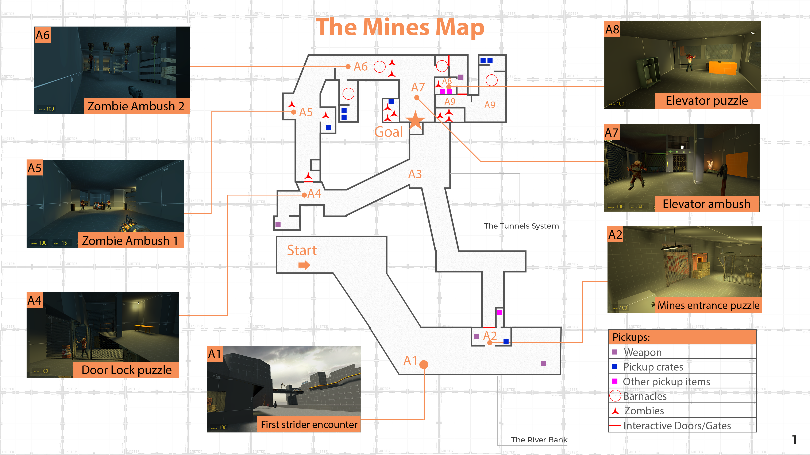

>🔗 For better readability, I recommend viewing the document in Google Sheets format: [Google Sheets format](https://docs.google.com/spreadsheets/d/17luq0CCqfkIL_criP5OvxDQzWQod9SIVYd5c3S6c9CM/edit?usp=sharing)

  
See the reference image for easier orientation around the map

  

    
  

| **Zone**  | Gameplay and Logic Checklist                                                                      | Status | Notes |
| ----- | ------------------------------------------------------------------------------------------------- | ------ | ----- |
|       | 🟥 **High priority**                                                                                      |        |       |
| **A1-A9** | **Level layout validation**                                                                           |        |       |
|       | All intended areas of the level are accessible                                                    |        |       |
|       | The player cannot get outside the playable bounds                                                 |        |       |
|       | Level geometry has consistent collision (no invisible walls)                                      |        |       |
|       | **Entity functionality**                                                                              |        |       |
| **A1**    | 📌 **Level start**                                                                                         |        |       |
|       | Player spawn (info_player_start) entity is properly set up:                                       |        |       |
|       | *\- Position*                                                                                        |        |       |
|       | *\- Orientation*                                                                                    |        |       |
|       | item_suit is placed correctly over info_player_start                                              |        |       |
| **A1**    | 📌 **First Strider encounter**                                                                         |        |       |
|       | **Sequence start**                                                                                    |        |       |
|       | Strider scene trigger (Trigger_once) functions correctly:                                         |        |       |
|       | *\- Triggrers cameo_strider_maker (npc_template_maker)*                                             |        |       |
|       | **NPC spawning**                                                                                      |        |       |
|       | cameo_strider_maker (npc_template_maker) functions correctly:                                     |        |       |
|       | *\- Spawns cameo_strider (npc_strider)*                                                            |        |       |
|       | **NPC pathing**                                                                                       |        |       |
|       | cameo_strider moves across the bridge towards cameo_strider_0_goal_1 (path_corner)                |        |       |
|       | *\- info_node_air_hint entities are properly spaced along the path*                                 |        |       |
|       | *\- info_node_air_hint entities use the correct Hint Group: stry0*                                  |        |       |
|       | *\- strider disappears after reaching cameo_strider_0_goal_1*                                       |        |       |
|       | **Misc**                                                                                              |        |       |
|       | player-strider0 (ai_relationship) is set so the strider ignores the player                        |        |       |
| **A2**    | 📌 **Mines Entrance Puzzle**                                                                             |        |       |
|       | **Essential weapon pickup**                                                                           |        |       |
|       | Crowbar (weapon_crowbar) is obtainable                                                            |        |       |
|       | **Mines entrance room**                                                                               |        |       |
|       | The player can remove 4 wooden planks (func_breakable) blocking the door                          |        |       |
|       | **Essential weapon pickup**                                                                           |        |       |
|       | Gravity gun (weapon_physcannon) is obtainable                                                     |        |       |
|       | **Metal gate**                                                                                        |        |       |
|       | Metal_gate (func_physbox) opens correctly:                                                        |        |       |
|       | *\- The player can remove 2 planks (func_physbox) supporting the mines gate*                        |        |       |
|       | *\- ballsocket2 (phys_ballsocket) enables smooth gate rotation*                                     |        |       |
|       | **Autosave 1**                                                                                        |        |       |
| **A3**    | Autosave1 volume (trigger_autosave) saves the game                                                |        |       |
| **A4**    | 📌 **Door lock puzzle**                                                                                  |        |       |
|       | **Sequence start**                                                                                    |        |       |
|       | Thump_trigger2 (trigger_once) functions correctly:                                                |        |       |
|       | *\- Triggers window_thumper_spawner2 (npc_template_maker)*                                          |        |       |
|       | **NPC spawning**                                                                                      |        |       |
|       | window_thumper_spawner2 (npc_template_maker) works correctly:                                     |        |       |
|       | *\- Spawns window_thumper2 (npc_zombie)*                                                            |        |       |
|       | *\- Triggers window_thump2 (scripted_sequence)*                                                     |        |       |
|       | **Scripted Sequence (Door pound animation)**                                                                    |        |       |
|       | window_thump2 (scripted_sequence) has proper inputs:                                              |        |       |
|       | *\- Target NPC: window_thumper2*                                                                    |        |       |
|       | *\- Action animation: WallPound*                                                                    |        |       |
|       | *\- Loop Action Animation: Yes*                                                                     |        |       |
|       | *\- Interruptibility: Off*                                                                          |        |       |
|       | **Essential weapon pickup**                                                                           |        |       |
|       | Pistol (weapon_pistol) is obtainable                                                              |        |       |
|       | **Door Lock Interaction**                                                                             |        |       |
|       | rubble_tunnel_door_2_lock (prop_physics_override) works correctly:                                |        |       |
|       | *\- can be destroyed*                                                                               |        |       |
|       | When destroyed:                                                                                   |        |       |
|       |   *\- Opens rubble_tunnel_door_2 (func_door_rotating) to open*                                        |        |       |
|       |   *\- Cancels cancels window_thump2 (scripted sequence)*                                              |        |       |
|       |   *\- Starts thumper2_zombie_schedule (aiscripted_schedule)*                                          |        |       |
|       | **AI Schedule Behavior**                                                                              |        |       |
|       | thumper2_zombie_schedule (aiscripted_schedule) works correctly:                                   |        |       |
|       | *\- Affects window_thumper2 (npc_zombie)*                                                           |        |       |
|       | *\- Zombie runs to thump2_zombie_target (info_target)*                                              |        |       |
| **A5**    |📌 **Zombie Ambush 1 sequence**                                                                          |        |       |
|       | **Sequence start**                                                                                    |        |       |
|       | Ambush_trigger_1 (trigger_once) works correctly:                                                  |        |       |
|       | *\- Turns on pocket_1_finder (npc_enemyfinder)*                                                     |        |       |
|       | *\- Triggers pocket_2_zombie_1_maker (npc_template_maker)*                                          |        |       |
|       | *\- Triggers pocket_2_zombie_2_maker (npc_template_maker)*                                          |        |       |
|       | **NPC spawning**                                                                                      |        |       |
|       | pocket_2_zombie_1_maker (npc_template_maker) works correctly:                                     |        |       |
|       | *\- Spawns pocket_2_zombie_1 (npc_zombie)*                                                       |        |       |
|       | *\- Triggers pocket_2_zombie_1_schedule (aiscripted_schedule)*                                   |        |       |
|       | pocket_2_zombie_2_maker (npc_template_maker) works correctly:                                     |        |       |
|       | *\- Spawns pocket_2_zombie_2 (npc_zombie)*                                                          |        |       |
|       | *\- Triggers pocket_2_zombie_2_schedule (aiscripted_schedule)*                                      |        |       |
|       | **AI Schedules**                                                                                      |        |       |
|       | pocket_2_zombie_1_schedule (aiscripted_schedule) works correctly:                                 |        |       |
|       | *\- Target NPC: pocket_2_zombie_1 (npc_zombie)*                                                     |        |       |
|       | *\- Goal entity: target_pocket1 (info_target)*                                                      |        |       |
|       | pocket_2_zombie_2_schedule (aiscripted_schedule) works correctly:                                 |        |       |
|       | *\- Target NPC: pocket_2_zombie_2 (npc_zombie)*                                                     |        |       |
|       | *\- Goal entity: target_pocket2 (info_target)*                                                      |        |       |
| **A6**    | 📌 **Zombie Ambush 2 sequence**                                                                          |        |       |
|       | **Sequence start**                                                                                    |        |       |
|       | Ambush_trigger 2 (trigger_once) works correctly:                                                  |        |       |
|       | *\- Triggers suprise_zombie1_maker (npc_template_maker)*                                            |        |       |
|       | *\- Triggers npc_zombie_wakeup2 (scripted_sequence)*                                                |        |       |
|       | *\- Turns on suprise_2_finder (npc_enemyfinder)*                                                    |        |       |
|       | *\- Breaks plank2 (func_breakable) (delay 0.10s)*                                                   |        |       |
|       | *\- Plays sound_shanty_zombiebreakthru (ambient_generic) (delay 0.10s)*                             |        |       |
|       | *\- Plays sound_shanty_zombiebreakthru_scream (ambient_generic) (delay 0.30s)*                      |        |       |
|       | **NPC spawning**                                                                                      |        |       |
|       | suprise_zombie1_maker (npc_template_maker) works correctly:                                       |        |       |
|       | *\- Spawns suprise_zombie1 (npc_zombie)*                                                            |        |       |
|       | *\- Triggers script_surprise_zombiebreakthru (scripted_sequence)*                                   |        |       |
|       | **Scripted Sequence (Zombie breaking through planks animation)**                                                  |        |       |
|       | script_surprise_zombiebreakthru (scripted_sequence) has proper inputs:                            |        |       |
|       | *\- Target NPC: suprise_zombie1*                                                                    |        |       |
|       | *\- Action animation: Breakthrough*                                                                 |        |       |
|       | *\- Interruptibility: Off*                                                                          |        |       |
|       | *\- Loop Action Animation: No*                                                                      |        |       |
|       | *\- Triggers (OnEndSequence): suprise_zombie1_schedule (aiscripted_schedule)*                       |        |       |
|       | **AI Schedule Behavior**                                                                              |        |       |
|       | suprise_zombie1_schedule (aiscripted_schedule) works correctly:                                   |        |       |
|       | *\- Target NPC: suprise_zombie1 (npc_zombie)*                                                       |        |       |
|       | *\- Goal entity: the player*                                                                        |        |       |
|       | **Scripted Sequence (Zombie wake-up animation)**                                                               |        |       |
|       | npc_zombie_wakeup2 (scripted_sequence) has proper inputs:                                         |        |       |
|       | *\- Target NPC: suprise_zombie2 (npc_zombie)*                                                       |        |       |
|       | *\- Action animation: slumprise_a2*                                                                 |        |       |
|       | *\- Interruptibility: Off*                                                                          |        |       |
|       | *\- Loop Action Animation: No*                                                                      |        |       |
| **A6**    | **Autosave 2**                                                                                        |        |       |
|       | Autosave2 volume (trigger_autosave) saves the game                                                |        |       |
| **A8**    | 📌 **Elevator puzzle**                                                                                   |        |       |
|       | **Sequence trigger**                                                                                  |        |       |
|       | Window_thump_trigger (trigger_once) works correctly:                                              |        |       |
|       | *\- Triggers window_thumper_spawner (npc_template_maker)*                                           |        |       |
|       | **NPC spawning**                                                                                      |        |       |
|       | window_thumper_spawner (npc_template_maker) works correctly:                                      |        |       |
|       | *\- Spawns window_thumper (npc_zombie)*                                                             |        |       |
|       | *\- Triggers window_thump (scripted_sequence)*                                                      |        |       |
|       | **Scripted Sequence (Window thump animation)**                                                                   |        |       |
|       | window_thump (scripted_sequence) has proper inputs:                                               |        |       |
|       | *\- Target NPC: window_thumper*                                                                     |        |       |
|       | *\- Action animation: WallPound*                                                                    |        |       |
|       | *\- Interruptibility: Off*                                                                          |        |       |
|       | *\- Loop Action Animation: Yes*                                                                     |        |       |
|       | - Can be canceled by:                                                                            |        |       |
|       |   *\- Damaging the target NPC*                                                                        |        |       |
|       |   *\- Window_thump_cancel_trigger (trigger_once)*                                                     |        |       |
| **A8**    | 📌 **Restoring elevator power**                                                                          |        |       |
|       | power_button_mines (func_button) starts:                                                          |        |       |
|       | *\- Unlocks elevator_button_bottom_floor (func_button)*                                             |        |       |
|       | *\- starts "turn_ON" animation*                                                                     |        |       |
|       | *\- disables elevator_spark (elevator_spark) near the elevator button*                              |        |       |
|       | *\- turns on the green_light (light) near the elevator button*                                      |        |       |
| **A7**    | 📌 **Elevator ambush sequence**                                                                          |        |       |
|       | **Pressing the elevator button**                                                                      |        |       |
|       | elevator_button_bottom_floor (func_button) works correctly:                                       |        |       |
|       | *\- Plays sound elevator_sounds (ambient generic)*                                                  |        |       |
|       | *\- Elevator elevator2 (func_tracktrain) starts descending*                                         |        |       |
|       | *\- Triggers elevator_events1 (logic_relay)*                                                        |        |       |
|       | *\- Triggers elevator_events2 (logic_relay)*                                                        |        |       |
|       | *\- Sequentially activates:*                                                                        |        |       |
|       |   *\-green_light1 (delay 10s)*                                                                        |        |       |
|       |   *\-green_light2 (delay 20s)*                                                                        |        |       |
|       |   *\-green_light3 (delay 30s)*                                                                        |        |       |
|       |   *\-green_light4 (delay 40s)*                                                                        |        |       |
|       | **Elevator ambush - Left room**                                                                       |        |       |
|       | Triggers elevator_events1 (logic_relay) works correctly:                                          |        |       |
|       | *\- Turns on enemyfinder_elev (npc_enemyfinder)*                                                    |        |       |
|       | *\- Plays roar_sounds (ambient_generic) (delay 2s)*                                                 |        |       |
|       | *\- Plays roar_sounds2 (ambient_generic) (delay 3s)*                                                |        |       |
|       | *\- Plays roar_sounds3 (ambient_generic) (delay 4s)*                                                |        |       |
|       | *\- Triggers zombie_breakthru_elevator1_maker (npc_template_maker) (delay 6s)*                      |        |       |
|       | *\- Triggers zombie_breakthru_elevator2_maker (npc_template_maker) (delay 6s)*                      |        |       |
|       | *\- Triggers zombie_breakthru_elevator3_maker (npc_template_maker) (delay 6s)*                      |        |       |
|       | *\- Breaks shack_door_3_expl (func_breakable) (delay 6,10s)*                                        |        |       |
|       | *\- Plays sound_shanty_zombiebreakthru44 (ambient_generic) (delay 6,10s)*                           |        |       |
|       | *\- Plays sound_shanty_zombiebreakthru_scream44 (ambient_generic) (delay 6,30s)*                    |        |       |
|       | **NPC spawning**                                                                                      |        |       |
|       | zombie_breakthru_elevator1_maker (npc_template_maker) works correctly:                            |        |       |
|       | *\- Spawns zombie_breakthru_elevator1 (npc_zombie)*                                                 |        |       |
|       | zombie_breakthru_elevator2_maker (npc_template_maker) works correctly:                            |        |       |
|       | *\- Spawns zombie_breakthru_elevator2 (npc_zombie)*                                                 |        |       |
|       | zombie_breakthru_elevator3_maker (npc_template_maker) works correctly:                            |        |       |
|       | *\- Spawns zombie_breakthru_elevator3 (npc_zombie)*                                                 |        |       |
|       | **Elevator ambush - Right room**                                                                      |        |       |
|       | Triggers elevator_events2 (logic_relay) works correctly:                                          |        |       |
|       | *\- Plays roar_sounds4 (ambient_generic) (delay14.30S)                                             |        |       |
|       | *\- Triggers zombie_breakthru_elevator4_maker (npc_template_maker) (delay 15s)*                     |        |       |
|       | *\- Triggers zombie_breakthru_elevator5_maker (npc_template_maker) (delay 15s)*                     |        |       |
|       | *\- Triggers zombie_breakthru_elevator6_maker (npc_template_maker) (delay 15s)*                     |        |       |
|       | *\- Triggers zombie_breakthru_elevator7_maker (npc_template_maker) (delay 15s)*                     |        |       |
|       | *\- Breaks shack_door_4_expl (func_breakable) (delay15.10)*                                         |        |       |
|       | *\- Plays sound_shanty_zombiebreakthru45 (ambient_generic) (delay15.10S)*                           |        |       |
|       | **NPC spawning**                                                                                      |        |       |
|       | zombie_breakthru_elevator4_maker (npc_template_maker) works correctly:                            |        |       |
|       | *\- Spawns zombie_breakthru_elevator4 (npc_zombie)*                                                 |        |       |
|       | zombie_breakthru_elevator5_maker (npc_template_maker) works correctly:                            |        |       |
|       | *\- Spawns zombie_breakthru_elevator5 (npc_zombie)*                                                 |        |       |
|       | zombie_breakthru_elevator6_maker (npc_template_maker) works correctly:                            |        |       |
|       | *\- Spawns zombie_breakthru_elevator6 (npc_zombie)*                                                 |        |       |
|       | zombie_breakthru_elevator7_maker (npc_template_maker) works correctly:                            |        |       |
|       | *\- Spawns zombie_breakthru_elevator7 (npc_zombie)*                                                 |        |       |
|       | **Using the elevator**                                                                                |        |       |
|       | elevator_button (func_button) works correctly:                                                    |        |       |
|       | *\- Closes elevator_door (prop_dynamic)*                                                            |        |       |
|       | *\- Starts elevator2 (func_tracktrain) ascent*                                                      |        |       |
| **A7**    | 📌 **Level transition**                                                                                  |        |       |
|       | Second_part_5 trigger (trigger_changelevel) successfully triggers the new level: Second_part_5.bsp |        |       |
|       | 📌 **Pickups**                                                                                           |        |       |
|       | 🟨 **Medium priority**                                                                                   |        |       |
|       | Optional weapons are obtainable:                                                                  |        |       |
| **A9**    | *\- Shotgun (weapon_shotgun)*                                                                       |        |       |
|       | All crates are obtainable:                                                                       |        |       |
| **A2**    | *\- item_crate_1 - contains: item_battery*                                                             |        |       |
| **A5**    | *\- item_crate_2 - contains: item_dynamic_resupply*                                                    |        |       |
| **A6**    | *\- item_crate_3 - contains: item_dynamic_resupply*                                                    |        |       |
| **A6**    | *\- item_crate_4 - contains: item_dynamic_resupply*                                                    |        |       |
| **A9**    | *\- item_crate_5 - contains: item_dynamic_resupply*                                                    |        |       |
| **A9**    | *\- item_crate_6 - contains: item_dynamic_resupply*                                                    |        |       |
| **A7**    | *\- item_crate_7 - contains: item_dynamic_resupply*                                                    |        |       |
|       | Individual items are obtainable:                                                                  |        |       |
| **A2**    | *\- item_battery x2*                                                                                   |        |       |
| **A8**    | *\- item_ammo_pistol*                                                                                  |        |       |
| **A8**    | *\- item_healthvial*                                                                                   |        |       |
|       | 📌 **Static enemies**                                                                                    |        |       |
|       | npc_barnacles function correctly:                                                                 |        |       |
| **A6**    | *\- x7 npc_barnacle*                                                                                   |        |       |
| **A7**    | *\- x3 npc_barnacle*                                                                                   |        |       |
| **A9**    | *\- x5 npc_barnacle*                                                                                   |        |       |
|       | 📌 **Interactable objects**                                                                              |        |       |
|       | Wooden crates are interactable:                                                                   |        |       |
| **A2**    | *\- x3*                                                                                                |        |       |
| **A3**    | *\- x4*                                                                                               |        |       |
| **A4**    | *\- x6*                                                                                                |        |       |
| **A6**    | *\- x2*                                                                                                |        |       |
| **A9**    | *\- x5*                                                                                                |        |       |
|       | Barells (non-explosive) are interactable:                                                         |        |       |
| **A5**    | *\- x2*                                                                                                |        |       |
| **A6**    | *\- x1*                                                                                                |        |       |
|       | Barells (explosive) are interactable:                                                             |        |       |
| **A4**    | *\- x1*                                                                                                |        |       |
| **A5**    | *\- x3*                                                                                                |        |       |
| **A7**    | *\- x1*                                                                                                |        |       |
